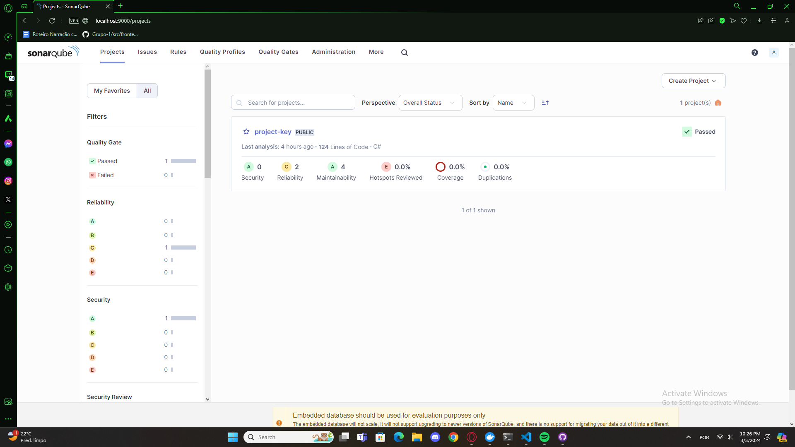
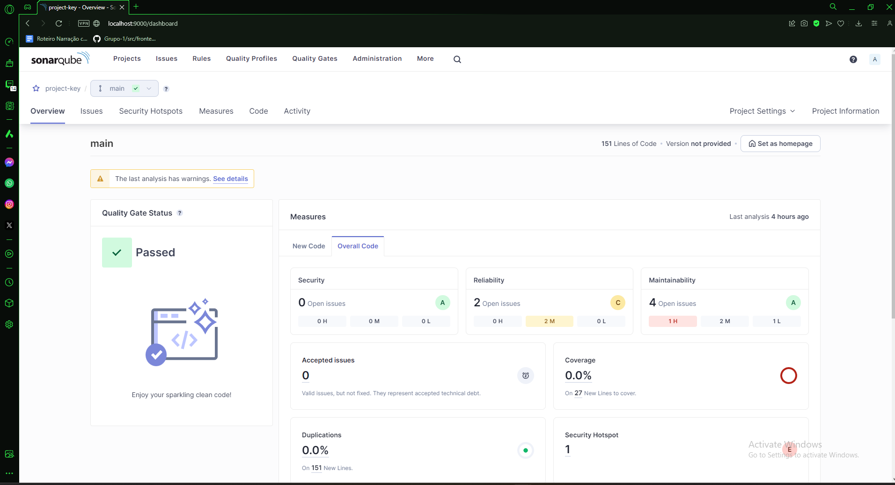
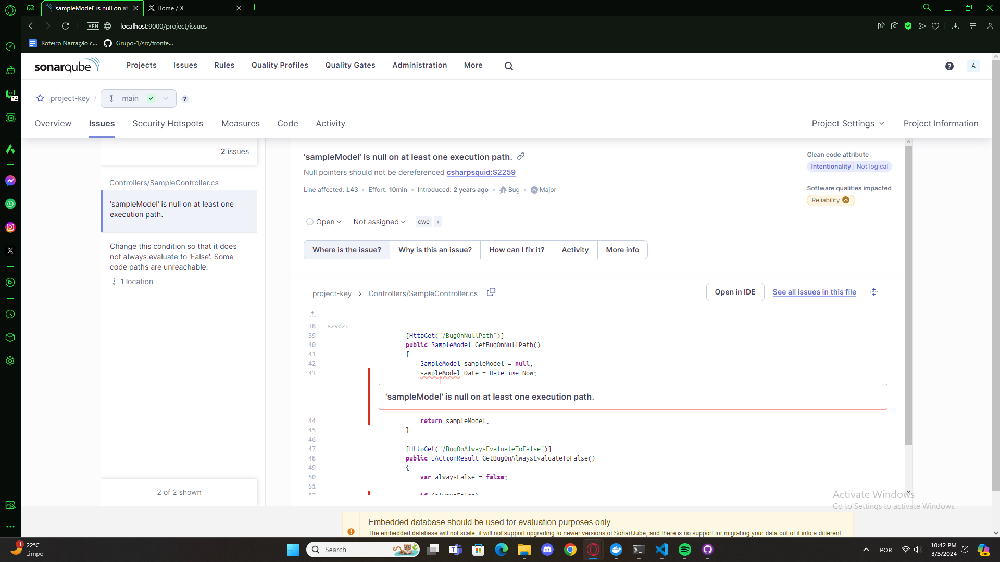

# Realizando análise de código estático com sonarqube

## Introdução

O tutorial aborda o uso da ferramenta SonarQube para encontrar erros e construir melhores códigos, as tecnologias que serão utilizadas nesse passo a passo são: Docker, Sonarqube e ASP.NET Core 3.0.

## Tecnologia e conceitos aprendidos

A principal tecnologia utilizada nessa atividade foi o Sonarqube, e o que consegui entender sobre a ferramenta, foi como podemos utilizar a mesma para identificar possíveis bugs, vulnerabilidades, e tudo isso através de um dashboard interativo, ela pode ser uma ferramenta muito boa tanto para a equipe de QA, quanto para times pequenos de desenvolvimento.

Nessa primeira imagem temos a tela de projetos, com o processo de scanner já realizado no repositório de testes do tutorial.

Na tela de overview do projeto podemos observar alguns indicativos sobre o projeto, como 2 open issues sobre Reliability e 4 open issues de Maintainability.

Podemos inclusive visualizar detalhes de cada issue e verificar diretamente no código o que estaria comprometendo a aplicação, facilitando assim a manutenção e correção de problemas com agilidade.

## Conclusão

A utilização do Sonarqube com o SonarScanner em conjunto, destaca-se como ferramente de grande impacto para auxiliar na garantia da qualidade de código, oferecendo análises essenciais que promovem codificações mais limpas e seguras.